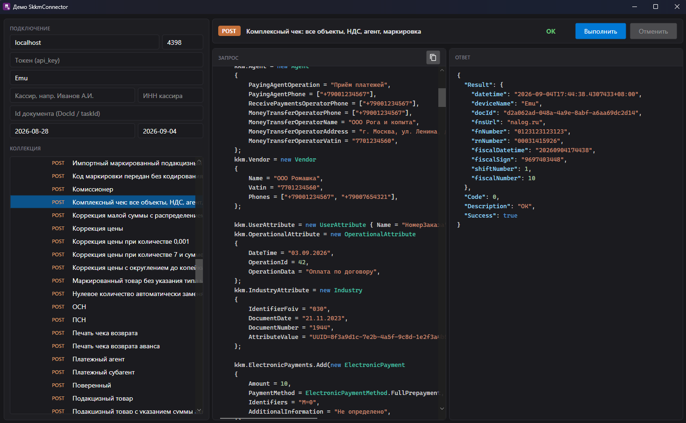
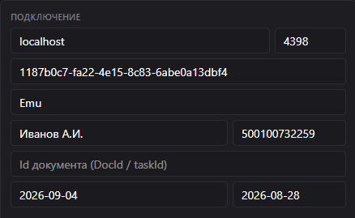

# Демо приложение коннектора для Сервера ККМ (C#)

Настольное приложение (Avalonia), которое показывает возможности библиотеки
[`SkkmConnector`](https://github.com/sodiUmU/SKKMConnector) вживую:
для каждого метода коннектора есть готовый пример - его **исходный код** видно на
экране, а **ответ сервера** приходит после нажатия «Запустить».

По сути это интерактивный справочник: слева - дерево примеров по группам API,
справа - что именно отправляем в коннектор и что получаем от Сервера ККМ.



---

## Содержание

- [Возможности](#возможности)
- [Требования](#требования)
- [Запуск](#запуск)
- [Настройка подключения](#настройка-подключения)
- [Как устроены примеры](#как-устроены-примеры)
- [Добавить свой пример](#добавить-свой-пример)
- [Стек](#стек)
- [Лицензия](#лицензия)

---

## Возможности

- **Все группы REST API** — примеры разложены по дереву, повторяющему структуру
  Сервера ККМ: авторизация, администрирование (ККТ, служба), кассовые смены, отчёты,
  печать чеков, коррекции (ФФД 1.2 и 1.0.5), возвраты, наличные, нефискальные чеки
  (слипы, картинки, рекламные), маркировка, фискализация, очередь, шаблоны, операции.
- **Код запроса** — в панели «Запрос» показан реальный C#-код примера: как
  заполняются свойства `ServerKkm` и какой метод вызывается (с подсветкой синтаксиса).
- **Ответ сервера** — в панели «Ответ» выводится результат вызова (JSON/поля).
- **Живой сервер** — примеры реально обращаются к Серверу ККМ по указанному адресу.

---

## Требования

- **.NET 6 SDK** (`net6.0`).
- **Запущенный Сервер ККМ** — адрес и порт службы печати (по умолчанию
  `localhost:4398`); для примеров подойдёт эмулятор ККТ.
- **Nuget пакет `SkkmConnector`** — демо берёт его из локальной папки `./packages`
  (см. [Запуск](#запуск)).

---

## Запуск

Приложение ссылается на NuGet-пакет `SkkmConnector` **1.26.4** и ищет его в локальной
папке `packages` рядом с проектом (`nuget.config`):

```xml
<add key="local-skkm" value="./packages" />
```

1. Положите файл `SkkmConnector.1.26.4.nupkg` в папку `SkkmNugetSample/packages`
   (если его там ещё нет - соберите пакет коннектора:

```powershell
dotnet pack C:\Users\user\Documents\Connector\SkkmConnector\SkkmConnector.csproj -c Release -o "C:\Users\user\Documents\Connector\SkkmNugetSample\packages"
```

   Подробности — в [README коннектора](READMEConnectorCSharp.md)).
2. Восстановите зависимости и запустите:

```powershell
cd SkkmNugetSample
dotnet restore
dotnet run
```

Либо откройте `SkkmNugetSample.sln` в Visual Studio / Rider и запустите как обычно (`F5`).

3. Запустите Сервер ККМ, чтобы можно было к чему обращаться.

---

## Настройка подключения

В верхней панели задаётся подключение — те же свойства, что у `ServerKkm`.
Значения по умолчанию (подсказки в полях):



| Поле          | Пример           | Свойство коннектора                     |
| ------------- | ---------------- | --------------------------------------- |
| Хост          | `localhost`      | `Host`                                  |
| Порт          | `4398`           | `Port`                                  |
| Токен         | `api_key`        | `Token`                                 |
| Устройство    | `Emu`            | `DeviceName`                            |
| Кассир        | `Иванов А.И.`    | `Cashier.Name`                          |
| ИНН кассира   | `500100732259`   | `Cashier.Vatin`                         |
| Id документа  | -                | `DocumentId`                            |
| Период с / по | последние 7 дней | `ShiftsFrom` / `ShiftsTo` (для списков) |

Токен нужен, только если на сервере выключен анонимный доступ. `Ping` работает
и без него.

---

## Как устроены примеры

Все примеры лежат в папке `Examples/` (дерево папок совпадает с группами API) и
включены в сборку как `Content`, чтобы приложение могло показать их исходный код
в панели «Запрос».

При старте `ExampleHost` сканирует сборку: находит все классы-наследники `Sample`
и сам собирает дерево — новый класс подхватывается без регистрации где-либо ещё.

Каждый пример - класс-наследник `Sample` с константами пути/названия и одним
публичным методом, возвращающим `Task<ServerKkm>` (префикс имени задаёт HTTP-метку
в дереве: `Get…` — GET, `Put…` — PUT, `Delete…` — DELETE, иначе POST):

```csharp
public class CheckSample01 : Sample
{
    public const string GroupPath = "Работа с ККМ|Печать чеков|Примеры чеков";
    public const string Title = "Продажа (базовый чек)";

    public async Task<ServerKkm> PostCheckSample01()
    {
        kkm.DeviceName = deviceName;
        kkm.Cashier = new Cashier { Name = cashierName, Vatin = cashierVatin };
        kkm.NewRequest();
        kkm.PaymentType = CheckType.Sale;
        kkm.TaxVariant = TaxSystem.ЕНВД;

        kkm.Positions.Add(new FiscalLine
        {
            Name = "Бутылка с водой 1л.",
            Quantity = 1m,
            Price = 30m,
            Sum = 30m,
            Tax = "20",
            SignMethodCalculation = SignMethodCalculation.FullPayment,
            SignCalculationObject = SignCalculationObject.Goods,
            MeasureOfQuantity = MeasureOfQuantity.Piece,
        });
        kkm.Payments = new Payments { Cash = 30m };

        await kkm.PrintCheck();
        if (!kkm.Ok)
            throw new InvalidOperationException(kkm.ErrorDescription);

        return kkm;
    }
}
```

- **`GroupPath`** — путь в дереве слева (разделитель `|`).
- **`Title`** — название примера в дереве.
- **Метод** — заполняет свойства `ServerKkm` (`kkm`) и вызывает метод коннектора;
  хост, порт, токен, касса и кассир подставляются из панели настроек через поля
  базового `Sample` (`deviceName`, `cashierName`, `cashierVatin`, `documentId`,
  `fromDate` / `toDate`).

Текст файла примера отображается в панели «Запрос»; результат вызова — в панели
«Ответ».

---

## Добавить свой пример

**В существующую группу** — создайте `.cs`-файл в подходящей папке внутри `Examples/`
(например, `Examples/Работа с ККМ/Кассовые смены/MyXReport.cs`) и добавьте класс:

```csharp
using SkkmConnector;

namespace SkkmNugetSample.Examples;

public class MyXReport : Sample
{
    // Путь в дереве слева (разделитель |)
    public const string GroupPath = "Работа с ККМ|Кассовые смены";
    // Название листа в дереве
    public const string Title = "Мой X-отчёт";
    // Необязательно: порядок среди соседей (меньше — выше)
    public const int SortOrder = 10;

    // Префикс метода: Get… / Put… / Delete… / иначе POST
    public async Task<ServerKkm> PostMyXReport()
    {
        kkm.DeviceName = deviceName;
        kkm.Cashier = new Cashier { Name = cashierName, Vatin = cashierVatin };

        await kkm.ReportX();
        if (!kkm.Ok)
            throw new InvalidOperationException(kkm.ErrorDescription);

        return kkm;
    }
}
```

**Новая группа** — создайте папку под `Examples/` и такой же класс в ней; путь в дереве
задаётся только константой `GroupPath` (папка на диске на отображение не влияет).
Порядок корневых узлов и известных групп можно подправить в `Ui/ExampleHost.cs`
(`RootOrder`, `KnownOrder`).

После сохранения файла:

1. Пересоберите проект (`dotnet build` или Rebuild в IDE).
2. Пример появится в дереве сам — отдельная регистрация не нужна.
3. В панели «Запрос» будет виден исходный код этого файла, в «Ответ» — результат вызова.

Полное описание методов, полей и типов — в [API.md](API.md) и
[README коннектора](READMEConnectorCSharp.md).

---

## Стек

- **Avalonia 11** (`Avalonia`, `Avalonia.Desktop`, `Avalonia.Themes.Fluent`) — интерфейс.
- **Material.Icons.Avalonia** — иконки.
- **SkkmConnector 1.26.4** — сам коннектор, подключён из локального NuGet-папки `./packages`.
- **.NET 6** (`net6.0`).
